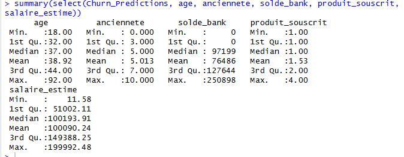
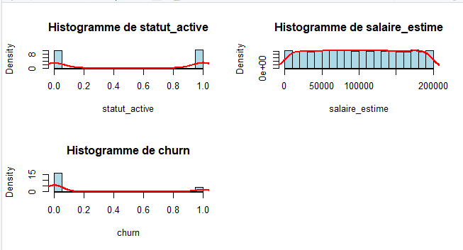
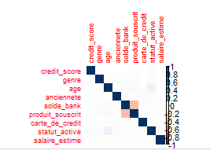
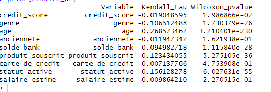
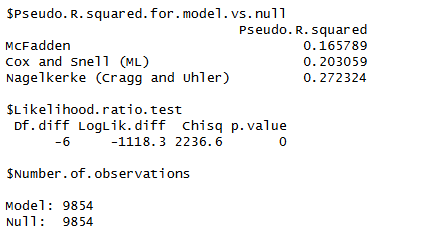
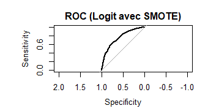
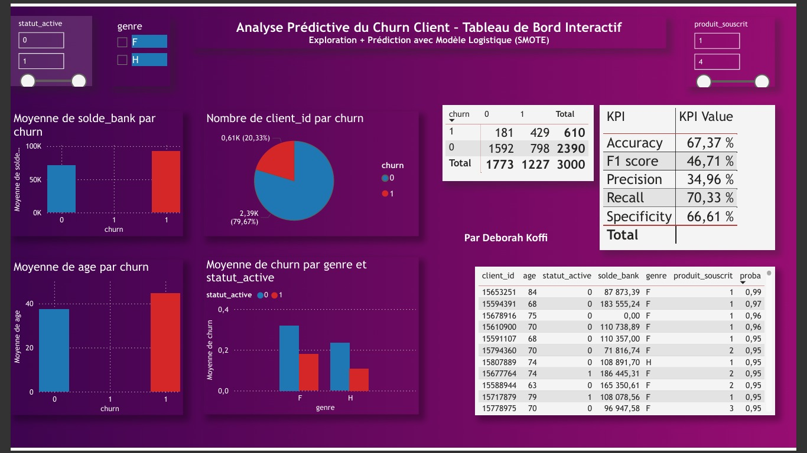

# churn-prediction
Modèle de prédiction du départ client avec visualisation des résultats

Objectif
Développer un modèle prédictif permettant d’anticiper le **départ des clients (churn = 0/1)** afin d’aider l’entreprise à renforcer ses actions de fidélisation.

---

## Données & préparation
- Importation du jeu de 10.000 données.
- Contrôles qualité :
  - Dimensions du dataset (11 variables et 10.000 lignes).
  - Valeurs manquantes (nombre et %) : pas de valeurs manquantes.
  - Doublons: pas de doublons
- Nettoyage :
  - Recodage de la variable `genre` (*Male = 1, Female = 0*).

---

## 🔎 Analyse exploratoire pour comprendre les donnees 
- Statistiques descriptives : `age`, `anciennete`, `solde_bank`, `produit_souscrit`, `salaire_estime`.

Les clients ont en moyenne :
38 à 39 ans, donc une population plutôt adulte et active.  
Une ancienneté d’environ 5 ans dans la banque, ce qui traduit une relation client assez stable.  
Un solde bancaire moyen de 76 000, mais avec une forte dispersion (certains comptes très faibles, d’autres très élevés).  
Un salaire estimé moyen autour de 100 000, ce qui suggère une clientèle relativement aisée.  
Et la majorité n’a qu’un ou deux produits bancaires (produit_souscrit ≈ 1,5).

- Tests de normalité (**Anderson–Darling**): permettent de vérifier si les variables suivent une loi normale.  
  Utile pour savoir si les données sont paramétriques ou non, et donc déterminer le type de tests statistiques à utiliser ensuite.

L'analyse des histogrammes montre que les variables ne suivent pas une loi normale.
ces observations confirment que les données sont non paramétriques, ce qui justifie l’usage de tests statistiques non paramétriques (comme Kendall ou Wilcoxon) pour l’étude des relations entre variables et le churn.

- Matrice de corrélation (multicolinéarité).

La matrice de corrélation ne révèle aucune multicolinéarité problématique.
Les variables peuvent donc être conservées pour la modélisation, car elles apportent une contribution unique à la prédiction du churn.

- Recherche de valeurs aberrantes (méthode IQR et z-score).
- Étude du lien entre variables et churn (corrélation de Kendall + test de Wilcoxon).

Bien que la plupart des p-values soient inférieures à 0,05 — indiquant des relations statistiquement significatives avec le churn — seules les variables dont le coefficient de Kendall (|τ| ≥ 0.1) présentent une corrélation réellement exploitable, à savoir : l’âge, le statut d’activité, le nombre de produits souscrits, le genre et, dans une moindre mesure, le solde bancaire.

---

## Partitionnement & rééquilibrage
- Séparation des données en **train/test (70/30)**.
- Constats : `churn=1` est minoritaire.
- Application de **SMOTE** pour rééquilibrer les classes sur l’échantillon d’entraînement.

---

## Modélisation
- Modèle utilisé : **régression logistique**.
- Variables explicatives : `age`, `statut_active`, `produit_souscrit`, `credit_score`, `solde_bank`, `genre`.
- Qualité validée avec l’indice de **Nagelkerke**.

En régression logistique, les indices de pseudo-R² (McFadden, Cox & Snell, Nagelkerke) évaluent la qualité d’ajustement globale du modèle, c’est-à-dire sa capacité à expliquer la variabilité du churn.

Le Nagelkerke R² ≈ 0.27, version ajustée du Cox & Snell, indique que le modèle explique environ 27 % du comportement de churn.
Ce résultat traduit une bonne cohérence globale des variables retenues et un niveau d’explication satisfaisant, typique d’un modèle prédictif appliqué à des données réelles.

Bien que le churn soit également influencé par des facteurs externes non observés tels que la satisfaction client, les offres concurrentes, les changements de situation personnelle ou les conditions économiques, le modèle parvient à en expliquer une part significative à partir des données disponibles.
---

## Évaluation
- Prédictions sur l’échantillon test (non-SMOTE).
- Seuil de décision ajusté : **0,40**.
- **Matrice de confusion** : précision, rappel, accuracy.
- **Courbe ROC & AUC** : bonne capacité discriminante.
  

---

## Restitution
- Analyse sur Power Bi.

Interprétation
Lecture des visualisations
- Âge et churn : la moyenne d’âge des clients churners est plus élevée, confirmant que les clients plus âgés sont plus enclins à quitter la banque.
- Solde bancaire et churn : les churners ont un solde plus élevé, suggérant qu’ils sont financièrement autonomes et donc plus susceptibles de migrer vers d’autres offres.
- Statut actif et churn : les clients inactifs churnent davantage, ce qui met en évidence l’importance de l’engagement client.
- Genre et churn : une légère différence est observée : les femmes légèrement plus touchées selon le graphique, mais l’effet reste faible.
- Nombre de produits souscrits : les clients avec peu de produits (1 seul) quittent plus souvent la banque, alors que ceux avec plusieurs produits (3 ou 4) sont plus fidèles.

Matrice de confision

- 1592 clients fidèles correctement identifiés (restés et prédits comme 0).
- 429 churners correctement détectés (partis et prédits comme 1).
- 798 faux positifs → prédits comme churners mais restés.
- 181 faux négatifs → prédits comme fidèles mais partis.

Le modèle reconnaît mieux les clients fidèles que les churners, mais conserve une bonne capacité à détecter ceux à risque.
Avec un seuil fixé à 0,4, le choix a été de privilégier le recall : il vaut mieux prévenir trop de clients à risque que d’en laisser partir sans alerte.
Ce choix permet à l’entreprise d’agir de manière proactive pour fidéliser les clients à risque et réduire les pertes.

---

## Prise de Decision
Selon les résultats du modèle, plusieurs leviers d’action prioritaires se dégagent pour anticiper le départ des clients et renforcer leur fidélité.

- Cibler les clients à risque élevé (prédits avec une probabilité > 0.8 dans le modèle).
Exemple : clients âgés, inactifs, avec peu de produits souscrits.
- Mettre en place une relance proactive :
Appels personnalisés ou emails pour comprendre les causes du désengagement.
- Offres de fidélisation : réduction de frais, bonus de produits, avantages exclusifs.
- Renforcer l’engagement client :
Encourager l’utilisation régulière des services bancaires (ex. application mobile, carte, épargne automatique).
- Campagnes de sensibilisation pour réactiver les comptes inactifs.
- Développer la multi-détention de produits :
Proposer des packs ou avantages à partir de 2 produits (carte + épargne, carte + prêt).
Objectif : rendre la relation client plus complète et plus difficile à rompre.

---

##Packages R utilisés
`readxl`, `dplyr`, `nortest`, `corrplot`, `caret`, `smotefamily`, `pROC`, `rcompanion`.

